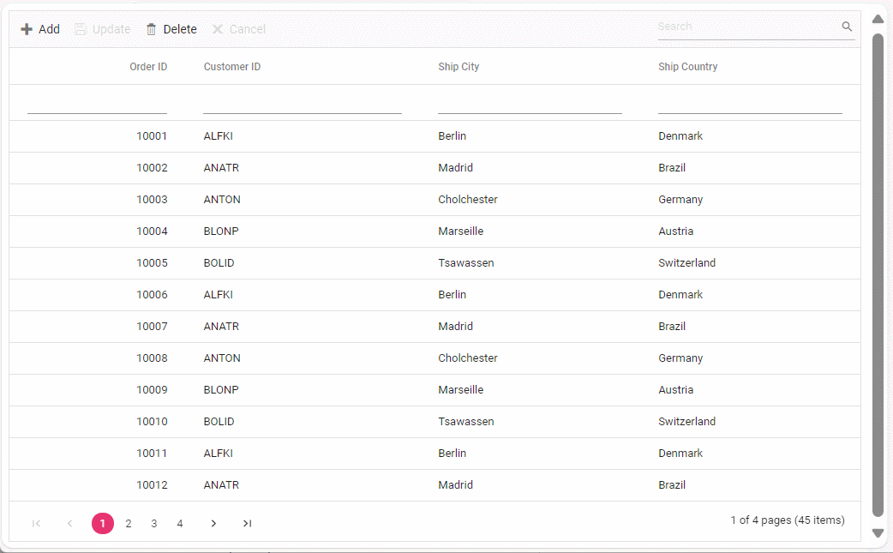

# UrlAdaptor in Syncfusion Grid Component

The UrlAdaptor serves as the base adaptor for facilitating communication between remote data services and an UI component. It enables seamless data binding and interaction with custom API services or any remote service through URLs. The UrlAdaptor is particularly useful for the scenarios where a custom API service with unique logic for handling data and CRUD operations is in place. This approach allows for custom handling of data and CRUD operations, and the resultant data returned in the result and count format for display in the Syncfusion Grid component.

## Getting Started

**1. Clone the Repository:**

Use `git clone` to fetch the repository from GitHub.

```bash
https://github.com/SyncfusionExamples/Binding-data-from-remote-service-to-typescript-data-grid.git 
```

**2. Open and Build the Project:**

* Open the project in Visual Studio.
* Build the project to restore dependencies and compile it.
* Run the project

**3. Explore the Code:**

* Navigate to TypeScript files (typically in src or scripts).
* Debug and interact with the code as needed.



## Resources

You can also refer the below resources to know more details about Syncfusion Typescript Grid components.

* [Demo](https://ej2.syncfusion.com/demos/#/bootstrap/grid/over-view)
* [Documentation](https://ej2.syncfusion.com/documentation/grid/getting-started)
* [GraphQL with Syncfusion DataManager](https://ej2.syncfusion.com/documentation/grid/connecting-to-adaptors/url-adaptor)